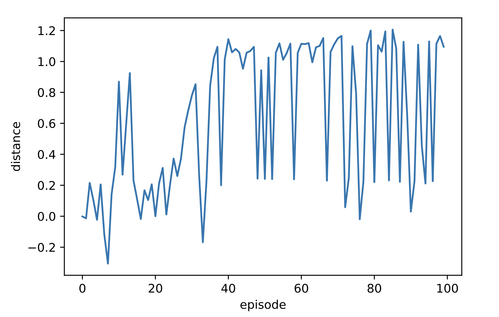

# Result Video

- [op3_controller_demo](op3_controller_demo.mp4)

# 手法の説明 / Methods
深層強化学習(DQN)を使用しています．  
This package uses deep reinforcement learning (DQN).  

行動価値関数は，3層のニューラルネットワーク(NN)として定義しQ値を以下のように更新し，  
The action value function is defined as a three-layer neural network (NN), and the Q-value is updated as follows  

$Q(s_t,a_t) = Q(s_t,a_t) + \eta(R_{t+1)} + \gamma \max_a Q(s_{t+1},a) - Q(s_t,a_t)$

損失関数$L$を用いて誤差逆伝播しニューラルネットを更新しています．  
The neural network is updated by back propagation using the loss function L.

$ L = \mathbb{E}(R_{t+1} + \gamma \max Q(s_{t+1},a_t)- Q(s_t,a_t))$

# プログラムの説明 / code
## [function.py](https://github.com/yuhi-sa/op3_walk/blob/main/scripts/function.py) and [motion.py](https://github.com/yuhi-sa/op3_walk/blob/main/scripts/motion.py)

[function]にはエージェントの定義を書いています．  
[function] contains the definition of the agent.  

Agentクラスが，ニューラルネットの定義をしているBrainクラスを持っています．  
The Agent class has a Brain class that defines the neural network.  

ReplayMemoryクラスに蓄積される行動と状態で，Brainは損失の計算と更新を行います．  
With the actions and states stored in the ReplayMemory class, Brain calculates and updates the loss.  

行動は離散化しており，[motion]で定義されている行動の中から，epsilon-greedy選択を行います．  
The actions are discretized, and epsilon-greedy selection is made among the actions defined in [motion].

こちらの書籍のコードを参考にしています．  
I used the code from this book as a reference.
- [Deep-Reinforcement-Learning-Book](https://github.com/YutaroOgawa/Deep-Reinforcement-Learning-Book)

## [learning.py](https://github.com/yuhi-sa/op3_walk/blob/main/scripts/learning.py)

[learning]では，[function]で定義したAgentクラスを継承します．  
In [learning], it inherits from the Agent class defined in [function].  

Agentに，[controller]からsubscribeした状態を入力，行動を計算し，publishします．  
Input the state subscribed from [controller] to the Agent, calculate the action, and publish it.

こちらはニューラルネットワークの定義にpytorchを使っているため，python3系で実行する必要があります．    
This one uses pytorch to define the neural network, so it needs to be run in python3.

## [controller.py](https://github.com/yuhi-sa/op3_walk/blob/main/scripts/controller.py)

[controller]は．[learning]からpublishされた行動をsubscribeして，実際にop3を動かします．  
[controller]. It subscribes to actions published by [learning] and actually runs op3.

そして，状態をpublishします．  
Then publish the state.

こちらはop3のパッケージの関係で，python2系で実行する必要があります．  
Due to the op3 package, you will need to run this in python2.

# 学習曲線
歩行距離の学習曲線 / Learning curve for walking distance

